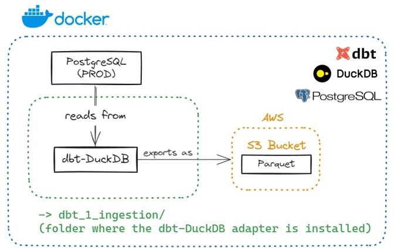

# ETL - Leveraging dbt-DuckDB to perform Ingestion Step (Reading from Postgres, converting to Parquet, and saving them into an S3 Bucket).

## Table of Contents

- [Project Structure](#project-structure)
- [Ingestion Step](#ingestion-step)

## Project Structure

- **dbt_1_ingestion (your-dbt-project)/**
    - **.dbt**
      - profiles.yml (connection details for our database environments)
    - **analyses**
    - **dbt_packages**
    - **logs** (ignored in git)
      - dbt.log
    - **macros**
      - **tests**
        - date_format.sql (macro to ensure date columns have date format)
      - generate_schema_name.sql (this macro makes sure your database schemas' names are respected)
    - **models**
      - **s3_bucket**
        - dbt_models_to_be_materialized_externally_as_parquet.sql
        - properties.yml
      - **sources**
        - sources.sql
    - **seeds**
    - **snapshots**
    - **target**           (ignored in git)
    - **tests**
    - **.gitignore**
    - **dbt_project.yml**  (the main file: this is how dbt knows a directory is a dbt project)
    - **packages.yml**     (where dbt packages should be configured)
    - **package-lock.yml** (created by dbt when the 'dbt deps' is executed against the packages.yml)
    - **README.md**
    - test_s3_access.ipynb (created to test S3 access)
    - test_duckdb.ipynb    (created test running queries against DuckDB)

## Ingestion Step

1) Ensure your environment is ready.
  * The Dockerfile and Docker Compose file will do this for you. You just need to open the repo with VSCode (make sure to have the prerequisites, as mentioned in the `Prerequisites` section above).
  * Check if the docker's bash terminal in VSCode can retrieve the postgres environment variables, for example: `env | grep POSTGRES`
  * Make sure to add the external CSV files to `external_postgres/data`.
    * These files were created so that we can insert data into Postgres and use it as if it were a **Postgres in Production**.

2) Ingest CSV files to Postgres
  * Open and run manually the `ingestion_in_raw.ipynb` noteboook.
  * This will create the necessary schemas (`raw`) by executing the `external_postgres/create_schemas.sql` script and tables (same names as the CSV files) in Postgres and insert the data from the CSV files. These files are one level above the `dbt_1_ingestion/` folder.

3) Configure your `profiles.yml`.
  * The `profiles.yml` is located in a `.dbt` folder at `dbt_1_ingestion/.dbt/profiles.yml`.
  * It defines connections to your data warehouse. It also uses environment variables to specify sensitive information like database credentials (which in this case is making reference to the `.env` file that is being ignored by `.gitignore`, so you should have one in the same level as the `docker-compose.yml` - as shown in the README from the overall project folder structure.)
  * This repo container the necessary information in `profiles.yml` to use DuckDB as an adapter.
4) Organize your dbt project directory.
  * `dbt_project.yml` file:
    * Under the `models > my_dbt_project` section, include only the bronze layer, because the `dbt_1_ingestion` project only performs the ingestion step.
  * `packages.yml` file:
    * It was created by me and not by dbt.
    * This file will specify the dependencies your project needs.
    * Make sure that the `dbt-utils` package is compatible with your `dbt-core` version (https://hub.getdbt.com/dbt-labs/dbt_utils/latest/)
    * Install dbt Packages:
      * `dbt clean` (to clean dependencies),
      * then `dbt deps` (this will look for the `packages.yml` file that should be in the same level as `dbt_project.yml`.)
  * `models/` folder: 
    * Contains the dbt models (i.e., SQL scripts or *.sql files) for the bronze layer.
    * For each layer (e.g.: `models/s3_bucket`) there is a `properties.yml` file. This file is where you specify data columns, tests, and any other property you want to ensure at each table in the schema. 
    * `models/sources/sources.yml`: Sources make it possible to name and describe the data loaded into your warehouse by your Extract-Load tool, i.e., the data from the CSV that was ingested into the bronze schema in DuckDB. When referencing these "source" tables in the dbt models, make sure to use the `{{ source('source_name','table_name') }}` jinja.
      * Notice that the `source_name` is defined with the `name:` tag in the `sources.yml` file.
  * `macro/` folder:
    * Here you create macros to use in your project.
    * An example is the `macro/tests/date_format.sql`. I created this macro in a `test/` folder to ensure that the date columns have a date format.
    * To apply this test, you need to put it in the `date_tests:` section of the `properties.yml` for the respective schema.
    * Moreover, you will find a `generate_schema_name.sql` macro that makes sure that the name we chose for the schema (i.e., the `dbt_caio` name) is the one being used when the schemas are created in DuckDB.

3) Test Connection to S3 Bucket
  * Run the `test_s3_Access.ipynb` noteboook.

4) Run dbt for the first dbt project (`dbt_1_ingestion/`)
  * run: `cd /workspace/dbt_1_ingestion` in the Docker Bash Terminal.
  * run: `dbt debug` in the Docker bash terminal (this makes sure the database connection is working).
  * run: `dbt deps` (this will install the packages within the `packages.yml` file.)
  * run: `dbt run` in the Docker Bash Terminal.
    * dbt will materialize the tables that DuckDB read from the `raw` schema in PostgreSQL and save them on a subfolder of a S3 Bucket as Parquet.
    * Example: (`s3://YOUR_S3_BUCKET_NAME/customers/customers.parquet`). 
    * The tables will also be materialized in DuckDB within the `dbt_caio` schema, following the best practices that are written as comments in the `profiles.yml` file. Use the `test_s3_Access.ipynb` noteboook to query DuckDB
  * Overall: DuckDB will read from PostgreSQL and write into the subfolder of your S3 Bucket as Parquet files.

Done! Now you have ingested files from a PostgreSQL database (as if it were in Production) to S3 Buckets.
